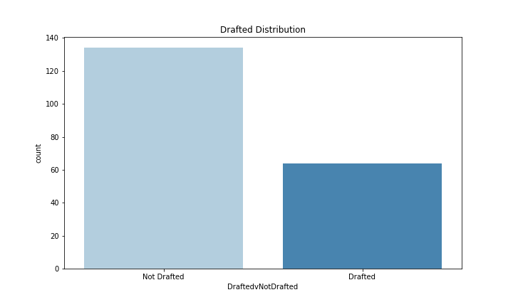
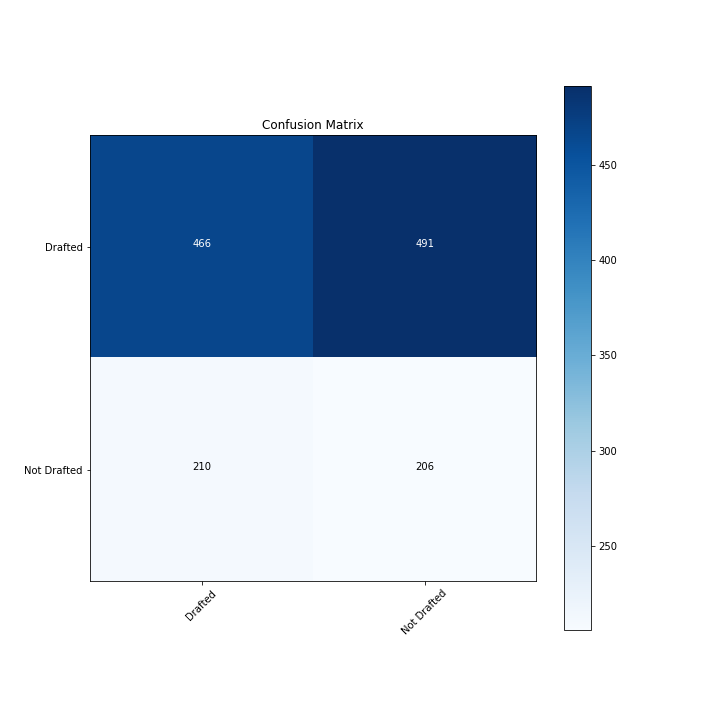
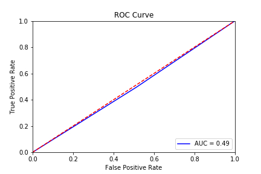
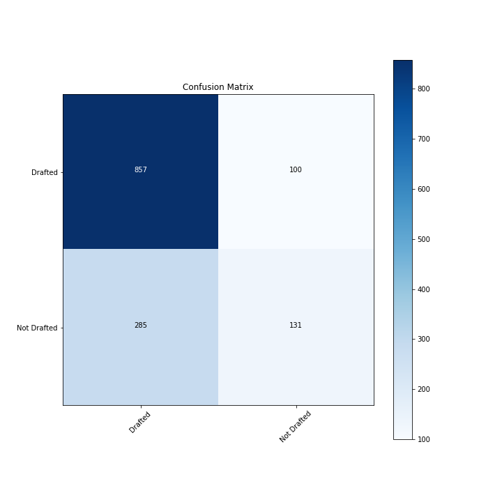
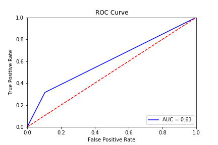
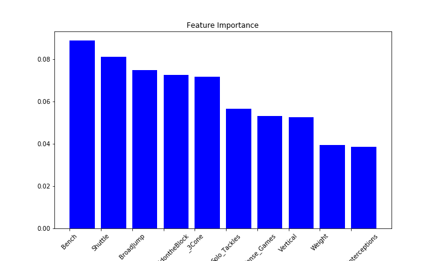

# Pick Me! Pick Me!
Maura Cerow

Data Sources:

   1. [combine data](https://www.pro-football-reference.com/draft/)  
   2. [college stats](https://www.sports-reference.com/cfb/players/)
  
## Introduction:

The goal of this project is to predict whether or not a prospect will be chosen in the NFL Draft. The data collected includes the results from the combine as well as the final year of college play for an individual player.

The libraries used in the project include:
    
    - Pandas
    - Numpy
    - Matplotlib
    - Seaborn
    - Sklearn
    - XGBoost
    - Missingno

In this repo you'll find the jupyter notebooks associated to the data process steps, a folder for images and the finalized data pickle file for use.

## Data Collection:

    see: 01_Data_Collection.ipynb
    
In order to collect my data, I scraped pro-football reference for the combine results from 2000-2020. My data includes Player Name, Position Played, School, Height, Weight and combine performance. This site also includes a link to the college stats for each player if available. I used this link for each player to college statistics around their final year of play before entering the draft. The college stats include notes around Total Touchdowns, Completion Percentage, Passing Yards, Total Tackles, etc.

In total, I was able to scrape almost 6.9k observations from the combine. Almost 5.5k observations have links provided for college stats that I was able to get. In the following notebook I merge my two dataframes and clean my data.

## Data Preprocessing:
 
    see: 02_Data_Cleaning.ipynb
    
Before I was able to merge my dataframes, I made sure to clean up my combine performance notebook. I had null values for events prospects didn't participate in, but I couldn't just fill those with 0. For some events, 0 represents an excellent score and others just the opposite. Instead, I replaced missing values with the average value for that event for the position a player plays. So for instance, if a Running Back is missing a value for the veritcal jump, the average Vertical Jump score for Running Backs replaces that missing value with a penalty.

With my clean combine data, I can read in my college stats data. I made sure to inlcude the link for the college stats in both dataframes so I could merge the two on the unique link. Once the dataframes were merged, I opted to drop the observations that didn't have college stats available. I'll work with the 5.5k observations from here on out.

I needed to replace null values with 0. I decided to replace null values versus dropping them because of the nature of the different positions. I wouldn't expect a punter to have sacks so it was understandable there were null values. I also made Height more workable, switching it to be in inches from a 'Feet-Inches' state.

One thing I was worried about was how to compare each individual prospects. There were players who played a full season and racked up tackles and completions galore, but then others that only played a handful of games. I created 'perGame' columns that simply took the metrics in each category - Defense, Passing, Rushing, Kicking, Punt Returning and Scoring - and divided them by the number of games a player played.

I also wanted to group my positions. I added 6 position groups - QBs, Receivers, OffensiveLine, DefensiveBacks, LBs, SpecialTeams - to group the positions based on similar roles. Having my positions grouped will make analyzing the two classes easier versus trying to look at all 25 positions on their own. That's a lot of columns to keep track of!

## EDA & Hypothesis Testing

    see: 03_EDA_&_Hypothesis_Testing.ipynb
    
The first thing I need to do is check the distribution of my data. Overall, I have 5.5k observations. My data is split 70/30 Drafted vs Not Drafted.

Since I assigned position groups in my preprocessing notebook, I looked at the distribution of drafted vs not drafted by each.

Looking at the position, I can see that position matters. Where my overall data is split 70/30, Offensive Line observations have a 77/23 split on Drafted vs Not Drafted. I want to include this metric in my column.

I also ran hypothesis tests around the metrics I thought would be important in identifying round picks. I started with Height and Weight, ran all of the combine results and all of my college stats metrics. If I can reject the null hypothesis -- where the null hypothesis is that Drafted and Not Drafted have the same mean -- I will include that metric in my features. Otherwise, they'll be dropped when the time comes. The goal of answering these questions is to justify including these features in my model. By running these hypothesis tests, I'm attempting to prove that they have statistically significant differences and are therefore useful in determining my output variable.
    
## Feature Engineering

    see: 04_Feature_Engineering.ipynb
    
Before I start modeling, I want to add some featuers based on the insights I gained from my EDA. I added the following new features to try to capture my target variable:

  * DoesntLieonDatingApps - around a player's height
  * SmallestKidontheBlock - around a player's weight
  * SendEmBackwards - around the number of tackle for a loss a player racks up
  * CatchTheQB - around the number of sacks a player records
  * Scores_Kicking_Pts - around kicking points
  
Scores_Kicking_Pts is a personal favorite. Kickers and Punters are only drafted 32% of the time in my data - that's the inverse of my total outcome! XP & Field Goals do in fact real games and a good kicker should matter!
    
## Modeling & Model Evaluation
  
    see: 05_Modeling_&_Model_Evaluation.ipynb
    
### Modeling
        
In order to track each model's success, I split my data to use a training set to fit a model and a test set to measure my evaluation metrics.

My first step is to get a baseline model. Using a dummy classifier, I built my point of comparison for all other models I will run my data through. I set up functions to train my data through different kind of classifiers including:

  * Logistic Regression
  * K-Nearest Neighbors
  * Decision Trees
  * Random Forest
  * Adaptive Boost
  * Gradient Boosting
  * XGBoost

I tuned my parameters, using grid search in some instances, and also addressed class imbalance using the following methods:

   * Random Undersampling
   * Random Oversampling
   * Tomek Links
   * SMOTE Tomek
   
In total, I ran my data through 30 models including the baseline. I tuned my hyperparameters to see what returned the best results before finally landing on my best one.
    
### Model Evaluation

To choose just what model is my **best** model, I wanted to strike a balance between Accuracy, F1 Score and my AUC Score. My accuracy would capture the ratio of just how many observations my model can appropriately classify. The F1 Score is the harmonic mean of precision and recall and the AUC is the area under the ROC Curve. Both F1 Score and AUC Score will give me an indication as to the quality of my classifier.

#### Baseline Model

My baseline model has an accuracy of .49, an F1 Score of .51 and an AUC Score of .49. It's not great, but it'll be my comparison point while I continue to model.

#### Best Model

To find a balanced model, I created a weighted average between the three metrics I'm interested in. I applied a 40% weight to Accuracy, 30% to F1 Score and 30% to my AUC Score. My best model it turns out is a gradient boosting model that's be tuned using grid search. This model has a .72 accuracy score, .69 F1 Score, and .61 AUC Curve. You can see in my ROC Curve that the line starts to move towards the left hand corner. It's moderately better at separating the classes compared to my baseline.

### Feature Importance

I graphed my top 10 features. In total I have 55 in my best models so it felt a little overwhelming to try to look at all of them. One thing that immediately stuck out to me was that all of my included combine results are in the top 10. College play doesn't seem to have a huge impact when trying to predict whether or not a prospect will be drafted.

## Conclusion & Next Steps

### Conclusion:

With a decent accuracy, I can tell you if you'll be drafted based on your combine results and the pertinent college stats. Combine results play a huge part in this while one's college play, not quite so much. 

### Next Steps:

The next step is to take this project to the next level -- predicting round and even pick number! It'll mean collecting more data. Being able to quantify team needs and collecting articles or tweets on a player's character will add so much more dimension to the current dataset.

I'd also like to add a neural network to improve accuracy. I'll lose the ability to see the feature importance, but it could prove worthwhile to get the accuracy up past .72.

One final future piece I'd like to do is actually build models based on the particular positions. I think that different positions place different emphasize on features so if to be utilizied as a tool for what needs to be worked on, it really should be player position specific.

## Presentation
[google slides](https://docs.google.com/presentation/d/1B8Ev0N20eYqUSgZaJah8Tq1tRi9pKltA3WiqSXeELWE/edit?usp=sharing)
