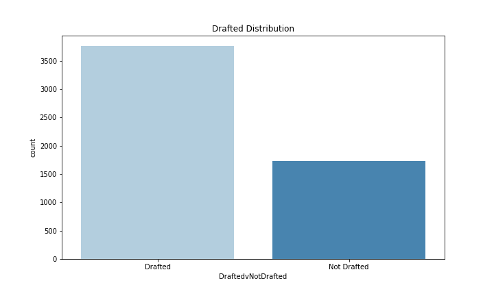
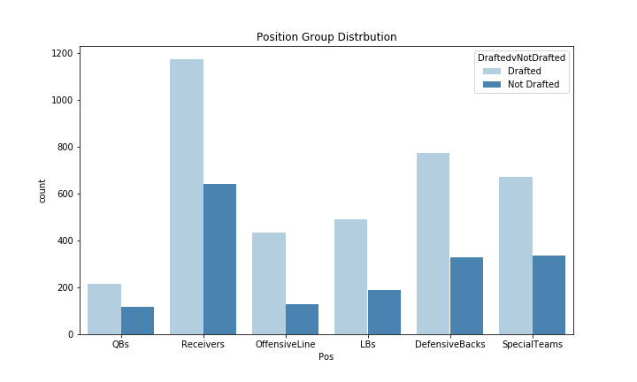

# Pick Me! Pick Me!
Maura Cerow

Data Sources:

   1. [combine data](https://www.pro-football-reference.com/draft/)  
   2. [college stats](https://www.sports-reference.com/cfb/players/)
  
## Introduction:

The goal of this project is to predict the rounds a prospect will be choosen in for the NFL Draft. The data collected includes the results from the combine as well as the final year of college play for an individual player.

The libraries used in the project include:
    
    - Pandas
    - Numpy
    - Matplotlib
    - Seaborn
    - Sklearn
    - XGBoost
    - Missingno

In this repo you'll find the jupyter notebooks associated to the data process steps, a folder for images and the finalized data pickle file for use.

## Data Collection:

    see: web_scraping.ipynb
    
In order to collect my data, I scraped pro-football reference for the combine results from 2000-2020. My data includes Player Name, Position Played, School, Height, Weight and combine performance. This site also includes a link to the college stats for each player if available. I used this link for each player to college statistics around their final year of play before entering the draft. The college stats include notes around Total Touchdowns, Completion Percentage, Passing Yards, Total Tackles, etc.

In total, I was able to scrape almost 6.9k observations from the combine. Almost 5.5k observations have links provided for college stats that I was able to get. In the following notebook I merge my two dataframes and clean my data.

## Data Preprocessing:
 
    see: data_preprocessing.ipynb
    
Before I was able to merge my dataframes, I made sure to clean up my combine performance notebook. I had null values for events prospects didn't participate in, but I couldn't just fill those with 0. For some events, 0 represents an excellent score and others just the opposite. Instead, I replaced missing values with the average value for that event for the position a player plays. So for instance, if a Running Back is missing a value for the veritcal jump, the average Vertical Jump score for Running Backs replaces that missing value with a penalty.

With my clean combine data, I can read in my college stats data. I made sure to inlcude the link for the college stats in both dataframes so I could merge the two on the unique link. Once the dataframes were merged, I opted to drop the observations that didn't have college stats available. I'll work with the 5.5k observations from here on out.

I needed to replace null values with 0. I decided to replace null values versus dropping them because of the nature of the different positions. I wouldn't expect a punter to have sacks so it was understandable there were null values. I also made Height more workable, switching it to be in inches from a 'Feet-Inches' state.

One thing I was worried about was how to compare each individual prospects. There were players who played a full season and racked up tackles and completions galore, but then others that only played a handful of games. I created 'perGame' columns that simply took the metrics in each category - Defense, Passing, Rushing, Kicking, Punt Returning and Scoring - and divided them by the number of games a player played.

I also wanted to group my positions. I added 6 position groups - QBs, Receivers, OffensiveLine, DefensiveBacks, LBs, SpecialTeams - to group the positions based on similar roles. It'll make visualizing the position and round picks easier later.

## EDA & Hypothesis Testing

    see: EDA_&_HypothesisTesting.ipynb
    
The first thing I need to do is check the distribution of my data. Overall, I have 5.5k observations. Almost 1/3 of that data is in 'Not Drafted'. Each round has anywhere from 400-600 observations.

Since I assigned position groups in my preprocessing notebook, I looked at the distribution of picks overall as well as by each individual round. 

First Round:

From the two graphs above, you can see that Receivers represent a good amount of my data - 33% in fact. But, in round 1, they're only 25% of the picks. Quarterbacks on the other hand are only 6% of my total data, My idea is that the position you play or position group you fall into will impact which round you're selected in.

I also ran hypothesis tests around the metrics I thought would be important in identifying round picks. I started with Height and Weight, ran all of the combine results through along with a condensed list of each of the college stats to check for usefulness.

The goal of answering these questions is to justify including these features in my model. By running these hypothesis tests, I'm attempting to prove that they have statistically significant differences and are therefore useful in determining my output variable.
    
## Feature Engineering

    see: feature_engineering.ipynb
    
Before I start modeling, I want to add some featuers based on the insights I gained from my EDA. I added the following new features to try to capture the round a prospect is picked in:

  * DoesntLieonDatingApps - around a player's height
  * SmallestKidontheBlock - around a player's weight
  * SendEmBackwards - around the number of tackle for a loss a player racks up
  * CatchTheQB - around the number of sacks a player records
  * NoRespect - around kicking points
  
NoRespect is a personal favorite. Kickers and Punters are more often picked in later rounds and the total kicking points you can see actually increases as you get to the later rounds. XP & Field Goals do in fact real games and a good kicker should matter!
    
## Modeling & Model Evaluation
  
    see: Modeling.ipynb
    
My modeling notebook is still very much a work in progress. I set up functions to train my data through different kind of classifiers including:

  * Logistic Regression
  * K-Nearest Neighbors
  * Decision Trees
  * Random Forest
  * Adaptive Boost
  * XGBoost
  * Naive Bayes

I also built a baseline model using a simple dummy classifier. It returned a model with a .11 accuracy on my test data. I think iterated through my more advanced classification model, manually tuning hyperparameters along the way. I iterated through 18 models beyond my baseline. My best model, an XGBoost, improved my accuracy, but only to .33. I know my modeling notebook has work to be done which I address in my Next Steps.
    
## Conclusion & Next Steps

### Conclusion:

Creating an alogrithm for draft picks is tricky! My best model only returned 33% of the test observations correctly. There's a lot of room for improvement from here.

### Next Steps:

As it stands now, my modeling process could use some work. I want to better tune my hyperparameters using GridSearch to improve my models. In addition, when I look at my confusion matrix for my best model, my model really wants observations to be 'Not Drafted'. I want to address class imbalance in my data and see if that improves my accuracy.

I'd like to then take my hopefully new and improved best model to understand feature importance. From that I can identify what exactly makes a draft pick. Is it all based on the position a player is in or based on the points he scores? In turn, prospects can work on the necessary skills to boost their standing.

Another way to try to classify is building a neural network. It won't be as interpretible as a Random Forest, but it could prove to be more accurate than my current classifiers.

## Presentation
[google slides](https://docs.google.com/presentation/d/1B8Ev0N20eYqUSgZaJah8Tq1tRi9pKltA3WiqSXeELWE/edit?usp=sharing)
